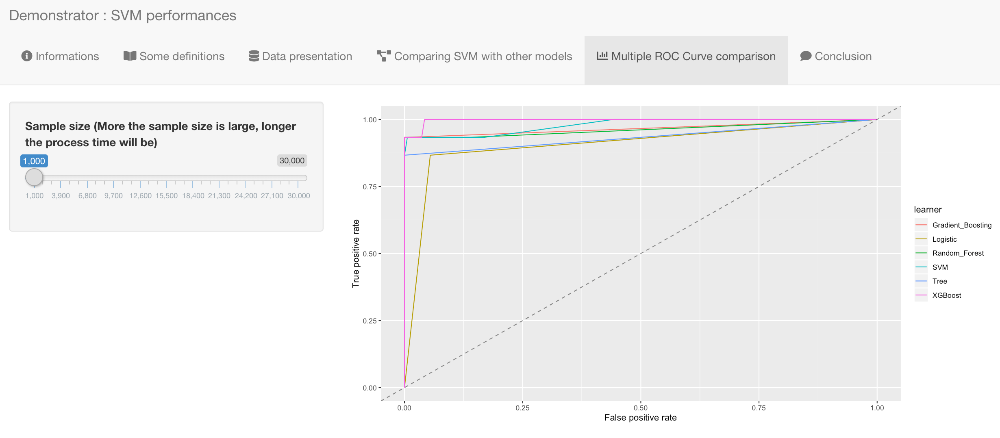

&nbsp;

&nbsp;

<strong style="color:black">The purpose of our demonstrator is to compare the performance of the SVM machine learning method with other machine learning methods (Logistic Regression, Decision Tree, Random Forest, Gradient Boosting, Xgboost). </strong>

&nbsp;

Note : the loading of the application depends on the network connection.  
Depending on the network speed, the application may take further time to load.

&nbsp;

### Project informations  

&nbsp;

&nbsp;

In a first tab, there are some informations about our project.  
There is also a link to access the README file as well as a link to download the user manual.

&nbsp;

### Explanations of the methodology

&nbsp;

&nbsp;

In a first part, we briefly explain the concept of SVMs and in a second part the different kernels.  
In the last part, we describe the various modifications made to the initial database and the methodology used to build the demonstrator. 

### Data presentation

&nbsp;

&nbsp;

First, you have the dimension of the dataset. So we have 316295 observations and all the 31 the variables (the output & 30 explanatory variables).
Then, you can observe two histograms, which represent on the left the importance of the 30 independant variables, given by the information gain ; and on the right side, the result of a significant test is shown, based on the Khi-2 test.

Before continuing, it's important to specify that for models to work properly, the  SMOTE function was used to resample the original sample which had rare default (when the occurrence 1 is near to 1%).
This function creates other observations with the 1 occurence, using the probability to determine the values of the other variables. So you go from 284315 with the value of class 0 and 492 with the value of class 1, to 284315 with the value of class 0 and 31980 with the value of class 1, because we smote to have 10% of the occurence 1.

&nbsp;

### Comparison of SVM with another model

&nbsp;

&nbsp;

#### __Inputs__

&nbsp;

##### _Model to compare with svm_

&nbsp;

You just have to select the model you want to compare with the SVM, as the : 

- Logistic Regression
- Decision Tree
- Random Forest
- Gradient Boosting
- XGBoost

&nbsp;

When you select another model than the logistic regression, beside,  you have parameters than you can change as you wish. They are selected in a way that they are optimal when you choose your model. The list of parameters (with the default value in brackets, as a reminder if you change that and want recover them) is : 

* <strong>for the Decision Tree : </strong>

  * <strong>Minsplit :</strong> represents the minimum number of observations in a node for a split to take place. (35) 

  * <strong>Minbucket :</strong> says the minimum number of observations I should keep in terminal nodes. (10) 

  * <strong>Cp :</strong> it's the complexity parameter. (0.167) 

* <strong>for the Random Forest : </strong>

  * 
<strong>Number of trees :</strong> number of trees to grow. Larger number of trees produce more stable models and covariate importance estimates, but require more memory and a longer run time. (108) 
  
  * 
<strong>Node Size :</strong> minimum size of terminal nodes. Setting this number larger causes smaller trees to be grown (and thus take less time). (11) 

  * <strong>Mtry :</strong> number of variables available for splitting at each tree node. (11) 

* <strong>for the Gradient Boosting :</strong> 

  * 
<strong>N trees :</strong> The total number of trees to fit. GBMs often require many trees; however, unlike random forests GBMs can overfit so the goal is to find the optimal number of trees that minimize the loss function of interest with cross validation. (414) 

  * <strong>Interaction depth :</strong> Number of splits GBM has to perform on a tree (starting from a single node). (7) 

  * <strong>Min obs in node :</strong> Refers to the minimum number of observations in a tree node. (17) 
  
  * <strong>Shrinkage :</strong> It's the regulation parameter which dictates how fast / slow the algorithm should move. (0.268) 

* <strong>for the XGBoost :</strong> 

  * <strong>Nround :</strong> It controls the maximum number of iterations. (481) 

  * <strong>Max depth :</strong> It controls the depth of the tree. Larger the depth, more complex the model; higher chances of overfitting. (16) 

  * <strong>Lambda :</strong> It controls L2 regularization (equivalent to Ridge regression) on weights. It is used to avoid overfitting. (0.563) 

  * 
<strong>Eta :</strong> It controls the learning rate, i.e., the rate at which our model learns patterns in data. After every round, it shrinks the feature weights to reach the best optimum. (0.183) 

  * <strong>Sub sample :</strong> It controls the number of samples supplied to a tree. (0.328) 

  * <strong>Min child weight :</strong> it blocks the potential feature interactions to prevent overfitting. (1.83) 

  * <strong>Col sample by tree :</strong> It controls the number of variables supplied to a tree. (0.41) 

&nbsp;

##### _SVM Kernel_

You can choose between those four kernels : 

- Linear 

- Polynomial 

- Radial Basis 

- Sigmoid 

The best kernel is linear, and it's selected by default. The optimal parameters are given by default aswell, but you can change them as you like and observe the result.

&nbsp;

##### _Kernel_

As a reminder, the optimal kernel is linear. 

&nbsp;

##### _C_

As a reminder, the optimal C is 42.03045. 

&nbsp;

##### _Sample size (the larger the size chosen, the longer the processing time will be)_

To get the results faster, the default observation value is set 1,000 observations, but you can aswell change it with the cursor.

Note that the sample size chosen has been split into two samples, with 70% of the data for the train dataset, and 30% for the test dataset.
The performances displayed are based on the test sample. 

&nbsp;

&nbsp;

#### __Outputs__

You could observe the following : 

- SVM : Gini coefficient 

- SVM : confusion matrix 

- SVM : good classification rate 

- Selected model : Gini coefficient 

- Selected model : Confusion matrix 

- Selected model : good classification rate 

- ROC Curve comparison between the SVM and the selected model 

You have to be patient when you change the model selected to be compared to the SVM : Warning message can appear, but it's just for the loading time. 

&nbsp;

### Comparison of each model's performance - ROC Curve

&nbsp;

#### __Inputs__

##### _Sample size (the larger the size chosen, the longer the processing time will be)_

To get the results faster, the default observation value is set 1,000 observations, but you can aswell change it with the cursor.

&nbsp;

#### __Outputs__

You can observe in the same graphic the ROC curve for each model, with the default optimal parameters.

You can see that it isn't easy to choose the best model regardless of the sample size because of the crossing. It's better to refer to the Gini index or the good classification rate we have in the previous tab.  

&nbsp;

### Conclusion  

&nbsp;

&nbsp;

In the last tab, there is a brief conclusion about our project on the fraud detection using the SVM method.

&nbsp;